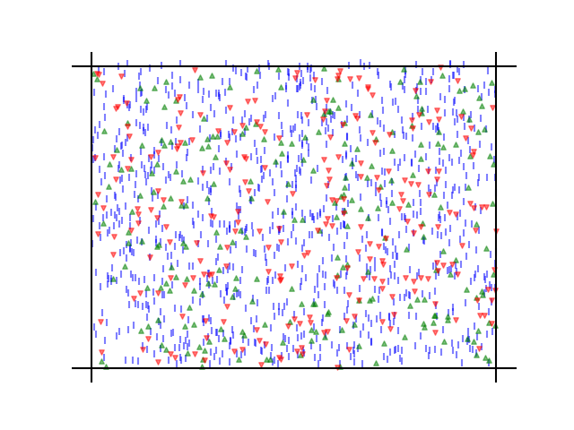

## Partial replication of Pluchino et al. 2018 [Link pdf](https://www.worldscientific.com/doi/pdf/10.1142/S0219525918500145)

Replication of algorithm and results from Pluchino, Biondo and Rapisarda 2018 article : _Talent versus luck: the role of randomness in success and failure_.

They shed new light on the effectiveness of assessing merit on the basis of the reached level of success and underlines the risks of distributing excessive honors or resources to people who, at the end of the day, could have been simply luckier than others. 

## The model
It is an agent-based model building on a small set of simple assumptions, aiming to describe the evolution of careers of a group of people infuenced by lucky or unlucky random events.

1000 moving individuals (_blue lines_) are randomly placed within a square world (size 1 * 1), with a talent T (which is a proxy for intelligence, skills, ability, etc.) normally distributed in the interval 0;1 around a mean of 0.6 with a standard deviation of 0.1.
In the square world, there are also 250 randomly placed lucky events (_green triangle_) and 250 unlucky events (_red triangle_). Neutral events are not considered in their model, since they have not relevant effects on the individual life. Both lucky and unlucky events are uniformly distributed.

## A single exemple simulation

### Setup

During each simulation, which covers 40 years (from the age of 20 to the age of 60), each individual moves following random trajectories(random walks) and might be exposed to a certain number of event (lucky or unlucky) with a time step equal to six months (80 iterations).

At the beginning of the simulation, all agents are endowed with the same amount (10$) of capital, representing their starting level of success/wealth. This choice has the evident purpose of not offering any initial advantage to anyone. While the agents' talent is time-independent, agents' capital changes in time. During the time evolution of the model, i.e., during the considered agents' life period, all individuals move randomly around the world and, in doing so, they possibly intersect the position of some event. More in detail, at each time, each individual covers a distance of 0.02 (in a world of size 1 * 1) in a random direction. We say that an intersection does occur for an individual when an event-triangle is present inside a circle of radius 0.03 centered on the event (the event-triangle does not disappear after the intersection). Depending on such an occurrence, at a given time step (i.e., every six months), there are three different possible actions for a given agent :
* A given agent intercepts a lucky event: this means that a lucky event has occurred during the last six months (the production of an innovative idea is also considered as a lucky event occurring in the agent's brain). As a consequence, the given agent doubles her capital with a probability proportional to her talent, i.e., if the agent is smart enough to profit from his/her luck. Computed as if the agent talent > rand[0,1].
* A given agent intercepts an unlucky event: this means that an unlucky event has occurred during the last six month. As a consequence, the given agent halves her capital.
* No interception between a event-triangle and a given agent: this means that no relevant facts have happened during the last six months, thus the given agent does not perform any action.

The previous agents' rules (including the choice of dividing the initial capital by a factor 2, in case of unlucky events, and the choice of doubling it, in case of lucky ones, proportionally to the agent’s talent) are intentionally simple and can be considered widely shareable, since they are based on the common sense evidence that success, in everyone life, has the property to both grow or decrease very rapidly. Furthermore, these rules give a significant advantage to highly talented people, since they can make much better use of the opportunities offered by luck (including the ability to exploit a good idea born in their brains). On the other hand, a car accident or a sudden disease, for example, is always an unlucky event where the talent plays no role.

### Results

In the figure below, capital after the 40 years simulation is plotted as function of talent (with capital in logarithmic scale for a better visualization): it is evident that the most successful individuals are not the most talented ones. We can see that the most successful agents (green circles above the blue line) have a talent only slightly greater than the average value (0.6). 

We can also see that only 2 individuals own more than 80% of the wealth, and that more than 40% of the individuals are poor or extremely poor.
Furthermore, the most talented individual is actually extremely poor.

As a general conclusion, the most successful agents are almost never the most talented ones, but those around the average of the Gaussian talent distribution. The model shows the importance, very frequently underestimated, of lucky events in determining the final level of individual success.

